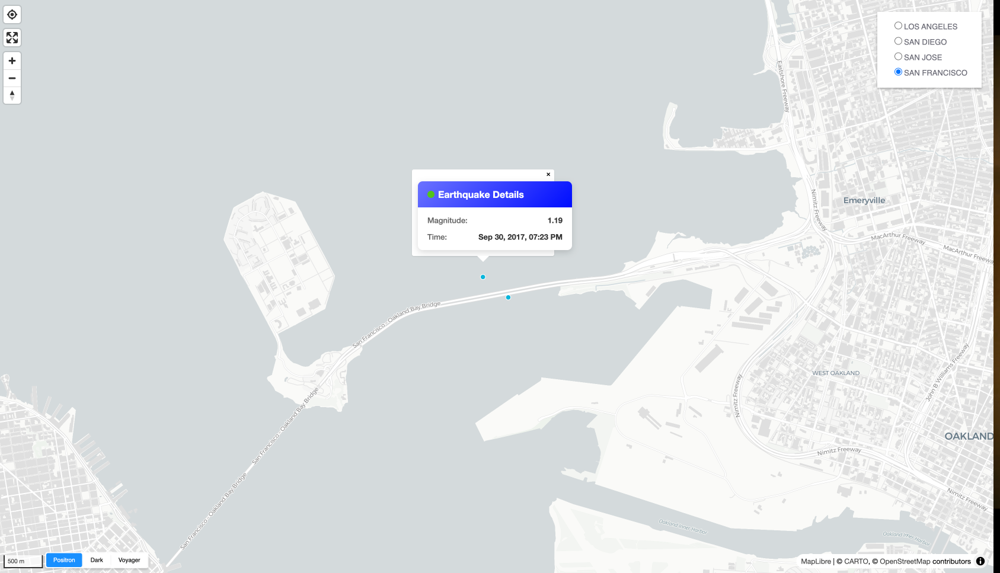

# 🌍 Earthquake Visualization Map


*Interactive map showing earthquake clusters and individual seismic events*

## ✨ Features

### 🗺️ Map Visualization
- **Smart Clustering** - Automatic point clustering at different zoom levels
- **Dual Popup System**:
  - **Click** for detailed earthquake information
  - **Hover** for quick magnitude preview
- **Basemap Switcher** - Toggle between multiple map styles
- **Draggable Markers** - Add and reposition custom points

### 📊 Data Presentation
- Color-coded by magnitude
- Temporal data visualization
- Depth indicators
- Location context

## 🛠️ Installation

```bash
# Clone the repository
git clone https://github.com/kimutaiwycliff/WEB-MAP-TEMPLATE.git
cd earthquake-map

# Install dependencies
pnpm install

# Start development server
pnpm start
